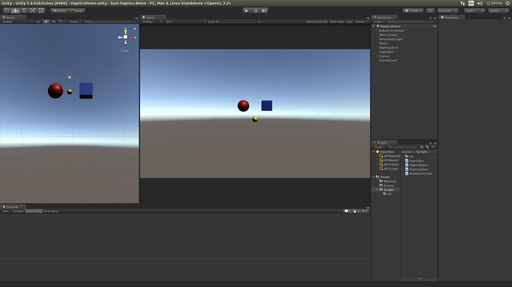

# barrett-burt-haptics-demo
> Simple Unity haptics demo

<!-- TOC depthFrom:1 depthTo:4 withLinks:1 updateOnSave:1 orderedList:0 -->

- [barrett-burt-haptics-demo](#barrett-burt-haptics-demo)
	- [Overview](#overview)
	- [Installation](#installation)
    	- [Clone the repository](#clone-the-repository)
    	- [Install dependencies](#install-dependencies)
    	- [Install the Unity editor](#install-the-unity-editor)
    - [Usage](#usage)
        - [Run the demo](#run-the-demo)
        - [Edit the project](#edit-the-project)
        - [Build an executable](#build-an-executable)
    - [Resources](#resources)
    - [Contributing](#contributing)
    - [Known issues](#known-issues)

<!-- /TOC -->

## Overview

This demo includes two simple haptic shapes and a haptic cursor that allows the user to feel the shapes with the Burt robot.
The source code to this demo contains information in the comments describing a method for creating custom haptic objects.



## Installation

***Make sure you are connected to the internet for installation. When installation is complete, disconnect the internet connection to run the demo.***

### Clone the repository

```
cd ~
git clone https://github.com/BarrettTechnology/barrett-burt-haptics-demo.git
```

### Install dependencies

```
cd ~/barrett-burt-haptics-demo
./scripts/install-dependencies.sh
```

### Install the Unity editor

* If you have already installed an older version of Unity:
  * If you are using a Unity Pro license, return the license in Help > Manage License > Return License
  * If needed, uninstall the Unity editor with `sudo apt-get remove unity-editor`.
* Download the Unity .deb from here: http://beta.unity3d.com/download/b7d937b6f596/unity-editor_amd64-5.6.0xb3Linux.deb
  (sha1sum 5d71b191d9f2099e0f5552c0b11e33003f441503)
* `cd Downloads` or wherever you downloaded that file to
* Depackage and install: `sudo dpkg -i unity-editor_amd64-5.6.0xb3Linux.deb`. This will fail the first time but is needed for the next step.
* Install dependencies with `sudo apt-get install -f`
* Rerun dpkg now that the dependencies have been fixed: `sudo dpkg -i unity-editor_amd64-5.6.0xb3Linux.deb`

## Usage

***Do not use the internet while running the demo. It slows down communication with the robot and can cause instability.***

### Run the demo

* First, ensure that your Burt robot is set up and connected according to the instructions included with your system, also available [here](http://support.barrett.com/wiki/Therapy/HardwareSetup).
* Open the Unity editor.
  * If this is the first time, and enter your license number (including hyphens) if applicable.
  * If the Unity editor fails to load the first time (gets stuck at a blank "Getting Started" screen), you may need
    to apply [this fix](https://forum.unity3d.com/threads/dark-grey-screen-fix.448936/). This usually happens with a fresh installation, not an upgrade.
* Open the project by clicking on open in the upper right corner and navigating to the base directory (`/path/to/barrett-burt-haptics-demo`) for the project.
* If you see any error messages, check the list of [known issues](#known-issues) below.
* In the Project panel, navigate to Assets > Scenes. Double click HapticsDemo to make sure the scene is selected. (Since there is only one scene, it should be open by default. If you add other scenes, this may not be the case.)
* Release the Burt E-stop.
* Click the Play button at the top center of the screen. It may take up to 15 seconds for the Burt to activate. If the Burt does not activate, end the game by pressing the Play button again, make sure the E-stop is released, and then begin the game again.
* Move the Burt endpoint to touch the haptic objects.
* When you are finished, press the Play button again to end the demo.
* Known issues:
  * Sometimes the Burt does not disable when the game ends. In this case, you can use the E-stop to turn off the motors. Often you can run the game again after releasing the E-stop, but in some cases the robot needs to be restarted. In this case, shut down the console completely (do NOT restart, because this does not power cycle the main board) and then turn it back on.

### Edit the project

* In the Project panel, go to the Assets > Scripts folder.
* Click once on that folder, and you will see a list of scripts included in this demo.
* Right click on any of these scripts and click "Open C# Project" to open the source code in MonoDevelop.
* Open all four scripts and read the documentation provided within.
* After editing the files, there are two ways to compile and check for errors:
  * (recommended) Save the files and return to the Unity editor window. The entire project will be compiled automatically, and error/warning messages will show up in the Console panel.
  * Press F8 to build from within MonoDevelop. You will see error and warning messages within MonoDevelop. This only checks your scripts, so you may still see new error/warning messages when you return to the Unity editor.
* Run the game and test.
  * If you have run-time errors, they will appear in the Console panel.
  * Debug messages (using `Debug.Log()`) also appear in the console panel. Use Debug messages sparingly, as they can slow down communication with the robot.

### Build an executable

* Go to File > Build Settings
* Set Target Platform to Linux.
* Set Architecture to x86_64.
* Click Build.
* Choose a location to save the build. It will generate a binary and a folder of assets. Keep these together for the program to run correctly.

## Resources

Unity provides excellent tutorials for new users. Here are some recommended tutorials to start with:
* [Roll a ball tutorial](https://unity3d.com/learn/tutorials/projects/roll-ball-tutorial)
* [Physics tutorials](https://unity3d.com/learn/tutorials/topics/physics)

There are many other tutorials available here:
* [Full tutorial list](https://unity3d.com/learn/tutorials)

Unity documentation is available here:
* [Unity manual v5.6.0xb3](https://docs.unity3d.com/560/Documentation/Manual/)

## Contributing

Developers please see [CONTRIBUTING.md](CONTRIBUTING.md)

## Known issues

* There is no sound in the editor, but sound works correctly in built versions of the game.
* In built versions of the game, you can't type characters that require shift or caps lock.
* When running the game, any time the scene changes you will see the following error: `INTERNAL ASSERT: The call to OnLevelWasLoaded has been deprecated for while now, consider removing it or bump the version check here`. This does not affect gameplay and can currently be ignored. There does not appear to be any instances of OnLevelWasLoaded in the code or dlls and there are no line number references in the error, so it is likely a Unity internal error which we have no control over.
* If you have upgraded from an older version of Unity, you may need to force the editor to remove and re-load projects to remove other errors. You can do this by renaming or deleting the project folder, starting the Unity editor (make sure your project is no longer listed on the Home screen), then moving it back to the original location (rename or clone from git), and opening the project again.
* Unity 5.6.0xb3 has [an issue](https://forum.unity3d.com/threads/oculusspatializer-plugin-error.444130/) with the OculusSpatializer Plugin. You may see the following error:
```
Couldn't open /opt/Unity/Editor/Data/UnityExtensions/Unity/VR/Android/AudioPluginOculusSpatializer.so, error: /opt/Unity/Editor/Data/UnityExtensions/Unity/VR/Android/AudioPluginOculusSpatializer.so: wrong ELF class: ELFCLASS32`
```
This error is harmless for Burt programs, but you can make it disappear by moving the plugin file
```
sudo mv /opt/Unity/Editor/Data/UnityExtensions/Unity/VR/Android/AudioPluginOculusSpatializer.so /opt/Unity/Editor/Data/UnityExtensions/Unity/VR/Android/AudioPluginOculusSpatializer.ignore
```
* If you wish to enable rotation of the view in the scene panel, you will need to disable moving a window with alt-left-mouse-button in linux. See [this article](http://askubuntu.com/questions/67518/how-to-disable-window-move-with-alt-left-mouse-button) for instructions. The combination of the first two answers seems to work.
